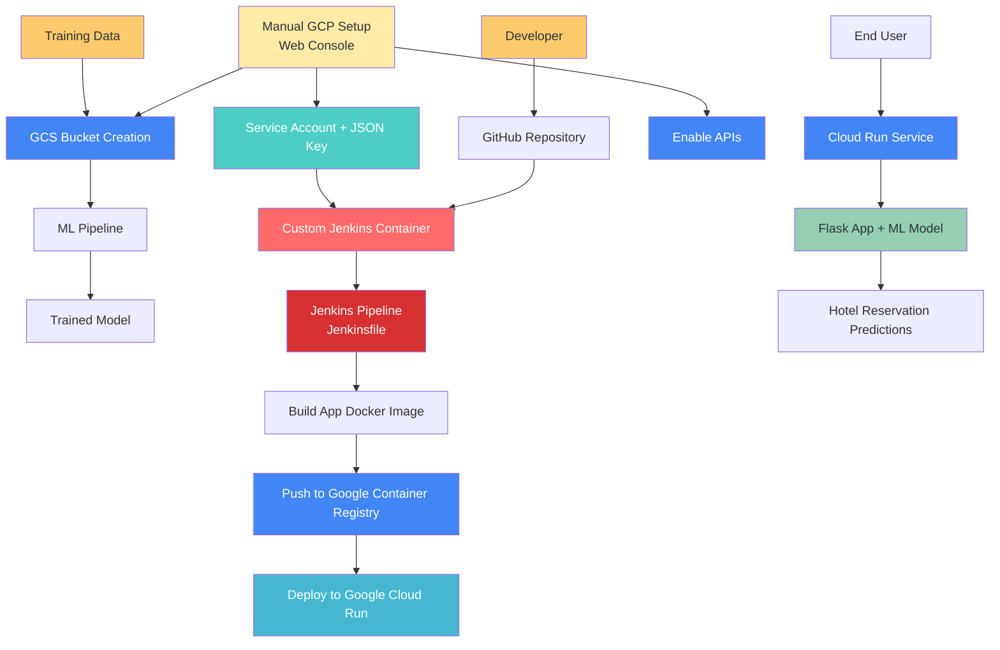

# 🏨 Hotel Reservation Prediction - End-to-End MLOps Pipeline

[](https://www.python.org/)
[](https://flask.palletsprojects.com/)
[](https://www.docker.com/)
[](https://cloud.google.com/run)
[](https://www.jenkins.io/)
[](https://mlflow.org/)

An end-to-end MLOps pipeline for predicting hotel reservation cancellations using machine learning. This project demonstrates a complete production-ready ML system with automated data ingestion from Google Cloud Storage, model training, deployment, and monitoring.

## 📋 Table of Contents

- [🎯 Project Overview](#-project-overview)
- [🏗️ Architecture](#️-architecture)
- [🚀 Quick Start](#-quick-start)
- [🤖 Machine Learning Pipeline](#-machine-learning-pipeline)
- [🔧 Local Development](#-local-development)
- [🔄 CI/CD with Jenkins](#-cicd-with-jenkins)

## 🎯 Project Overview

This project predicts whether a hotel reservation will be canceled based on various booking features. The system includes:

- **Data Ingestion**: Automated data fetching from Google Cloud Storage
- **Data Processing**: Feature engineering and data cleaning pipeline
- **Model Training**: LightGBM classifier with MLflow experiment tracking
- **Model Serving**: Flask web application for real-time predictions
- **MLOps Pipeline**: CI/CD with Jenkins and Docker
- **Cloud Deployment**: Automated deployment to Google Cloud Run

### 🎨 Features

- **Web Interface**: Flask-based prediction interface with form inputs
- **Real-time Predictions**: Binary classification for reservation cancellation risk
- **Model Versioning**: MLflow integration for experiment tracking and model registry
- **Automated Pipeline**: Jenkins CI/CD for building and deployment
- **Cloud-Native**: Designed for Google Cloud Platform with Container Registry and Cloud Run

## 🏗️ Architecture



### Workflow Overview

1. **Manual Setup**: Developer manually creates GCP project, enables APIs, creates storage bucket and service account via web console
2. **Custom Jenkins**: Uses custom Docker container with Docker and Google Cloud SDK pre-installed
3. **Manual Triggers**: Jenkins pipeline triggered manually via "Build Now" button
4. **Automated Build**: Jenkins builds app Docker image and pushes to Google Container Registry
5. **Cloud Deployment**: Automated deployment to Google Cloud Run for scalable serving

## 🚀 Quick Start

### Prerequisites

- Python 3.11+
- Docker
- Google Cloud SDK
- Jenkins (for CI/CD)
- Git

### Installation

1. **Clone the repository**

```bash
git clone https://github.com/your-username/hotel_reservation_prediction.git
cd hotel_reservation_prediction
```

2. **Set up virtual environment**

```bash
python -m venv venv
# Windows
venv\Scripts\activate
# Linux/Mac
source venv/bin/activate
```

3. **Install dependencies**

```bash
pip install -e .
```

4. **Set up Google Cloud credentials (Windows)**

```powershell
$env:GOOGLE_APPLICATION_CREDENTIALS = "path-to-your-service-account-key.json"
```

5. **Run the application**

```bash
python app.py
```

Visit `http://localhost:8080` to access the web interface.

## ☁️ Google Cloud Setup (Web Console)

### 1. Create Google Cloud Project

1. Go to [Google Cloud Console](https://console.cloud.google.com/)
2. Click **"Select a project"** → **"New Project"**
3. Enter project name: `hotel-reservation-mlops`
4. Click **"Create"**
5. Select your new project from the dropdown

### 2. Enable Required APIs

1. Go to **APIs & Services** → **Library**
2. Search and enable the following APIs:
   - **Cloud Storage API**
   - **Cloud Run API**
   - **Container Registry API**
   - **Cloud Build API**

### 3. Create Storage Bucket

1. Go to **Cloud Storage** → **Buckets**
2. Click **"Create Bucket"**
3. Configure bucket:
   - **Name**: `hotel-reservation-data-bucket` (must be globally unique)
   - **Location**: Choose your preferred region
   - **Storage class**: Standard
   - **Access control**: Uniform
4. Click **"Create"**
5. Upload your dataset:
   - Click **"Upload Files"**
   - Select your hotel reservation dataset (CSV file)
   - Note the filename for configuration

### 4. Create Service Account and Download JSON Key

#### Create Service Account

1. Go to **IAM & Admin** → **Service Accounts**
2. Click **"Create Service Account"**
3. Enter details:
   - **Service account name**: `hotel-reservation-service`
   - **Description**: `Service account for hotel reservation MLOps pipeline`
4. Click **"Create and Continue"**

#### Grant Required Roles

Add the following roles to your service account:

- **Owner** (full project access)
- **Storage Admin** (for bucket access)
- **Storage Object Viewer** (for reading data)

1. In the **"Grant this service account access to project"** section
2. Click **"Select a role"** and add each role listed above
3. Click **"Continue"** → **"Done"**

#### Download JSON Key File

1. Click on your created service account
2. Go to **"Keys"** tab
3. Click **"Add Key"** → **"Create new key"**
4. Select **"JSON"** format
5. Click **"Create"**
6. **Save the downloaded JSON file securely** (e.g., `hotel-reservation-service-key.json`)

### 5. Configure Authentication (Windows)

**PowerShell:**

```powershell
# Set the environment variable to point to your downloaded JSON key
$env:GOOGLE_APPLICATION_CREDENTIALS = "C:\path\to\your\hotel-reservation-service-key.json"
```

**Permanent Environment Variable (Recommended):**

1. Open **System Properties** → **Environment Variables**
2. Create new **User Variable**:
   - **Variable name**: `GOOGLE_APPLICATION_CREDENTIALS`
   - **Variable value**: `C:\path\to\your\hotel-reservation-service-key.json`

### 6. Update Project Configuration

Edit `config/config.yaml` with your bucket details:

```yaml
data_ingestion:
  bucket_name: "hotel_reservation_18"           # Update with your bucket name
  bucket_file_name: "Hotel_Reservations.csv"   # Update with your file name
  train_ratio: 0.8

data_processing:
  categorical_columns:
    - type_of_meal_plan
    - required_car_parking_space
    - room_type_reserved
    - market_segment_type
    - repeated_guest
    - booking_status
  numerical_columns:
    - no_of_adults
    - no_of_children
    - no_of_weekend_nights
    - no_of_week_nights
    - lead_time
    - arrival_year
    - arrival_month
    - arrival_date
    - no_of_previous_cancellations
    - no_of_previous_bookings_not_canceled
    - avg_price_per_room
    - no_of_special_requests
  skewness_threshold: 5
  no_of_features: 10
```

## 🤖 Machine Learning Pipeline

The ML pipeline is implemented in `pipeline/training_pipeline.py` and consists of three main stages:

### 1. Data Ingestion (`src/data_ingestion.py`)

- Downloads data from Google Cloud Storage bucket specified in `config/config.yaml`
- Splits data into train/test sets based on configured ratio (80/20)
- Saves raw data files to `artifacts/raw/`

### 2. Data Preprocessing (`src/data_preprocessing.py`)

- Processes categorical and numerical columns as defined in `config/config.yaml`
- Handles feature engineering and data cleaning
- Saves processed data to `artifacts/processed/`

### 3. Model Training (`src/model_training.py`)

- Trains LightGBM classifier model
- Tracks experiments using MLflow
- Saves trained model to `artifacts/models/lgbm_model.pkl`

### Running the Pipeline

```powershell
# Run the complete training pipeline
python pipeline/training_pipeline.py
```

This will execute all three stages sequentially and prepare the model for deployment.

```bash
# Run the complete training pipeline
python pipeline/training_pipeline.py
```

## 🔧 Local Development

### Running the Web Application

```bash
# Start the Flask development server
python app.py
```

The application will be available at `http://localhost:8080`

### Project Structure Details

```
hotel_reservation_prediction/
├── 📱 app.py                     # Flask web application
├── 🐳 Dockerfile                 # Application containerization
├── 🔧 Jenkinsfile                # CI/CD pipeline configuration
├── 📋 requirements.txt           # Python dependencies
├── ⚙️ setup.py                   # Package setup
├── 📊 artifacts/                 # Generated artifacts
│   ├── models/                   # Trained models
│   ├── processed/                # Processed datasets
│   └── raw/                      # Raw datasets
├── ⚙️ config/                    # Configuration files
│   ├── config.yaml              # Main configuration
│   ├── model_params.py          # Model parameters
│   └── paths_config.py          # File paths
├── 🔨 custom_jenkins/            # Custom Jenkins Docker
├── 📝 logs/                      # Application logs
├── 📈 mlruns/                    # MLflow experiment tracking
├── 📓 notebook/                  # Jupyter notebooks
├── 🔄 pipeline/                  # ML pipeline
│   └── training_pipeline.py     # Main training pipeline
├── 🧠 src/                       # Source code
│   ├── data_ingestion.py        # Data ingestion logic
│   ├── data_preprocessing.py    # Data preprocessing
│   ├── model_training.py        # Model training
│   ├── logger.py                # Logging utilities
│   └── custom_exception.py      # Custom exceptions
├── 🎨 static/                    # Web assets
│   └── style.css                # CSS styles
├── 🖼️ templates/                 # HTML templates
│   └── index.html               # Main web interface
└── 🔧 utils/                     # Utility functions    └── common_functions.py       # Common utilities
```

## 🔄 CI/CD with Jenkins

### Step 1: Install Docker Desktop

**Action**: Download and install Docker Desktop from [Docker&#39;s official website](https://www.docker.com/products/docker-desktop).
**Run Docker**: Start Docker Desktop and ensure it runs in the background.

### Step 2: Setup Jenkins Container

#### 1. Create Custom Jenkins Dockerfile

The project includes a custom Jenkins Docker image with Docker and Google Cloud SDK pre-installed in `custom_jenkins/Dockerfile`.

**Create the custom Jenkins Dockerfile** (`custom_jenkins/Dockerfile`):

```dockerfile
# Use the Jenkins image as the base image
FROM jenkins/jenkins:lts

# Switch to root user to install dependencies
USER root

# Install prerequisites and Docker
RUN apt-get update -y && \
    apt-get install -y apt-transport-https ca-certificates curl gnupg software-properties-common && \
    curl -fsSL https://download.docker.com/linux/debian/gpg | apt-key add - && \
    echo "deb [arch=amd64] https://download.docker.com/linux/debian bullseye stable" > /etc/apt/sources.list.d/docker.list && \
    apt-get update -y && \
    apt-get install -y docker-ce docker-ce-cli containerd.io && \
    apt-get clean

# Add Jenkins user to the Docker group (create if it doesn't exist)
RUN groupadd -f docker && \
    usermod -aG docker jenkins

# Create the Docker directory and volume for DinD
RUN mkdir -p /var/lib/docker
VOLUME /var/lib/docker

# Switch back to the Jenkins user
USER jenkins
```

#### 2. Build Custom Jenkins Image

```powershell
# Navigate to the project root directory
cd d:\MLOps\hotel_reservation_prediction

# Build the custom Jenkins image
docker build -t jenkins-dind ./custom_jenkins/
```

#### 3. Run Custom Jenkins Container

```powershell
# Run the custom Jenkins container with Docker socket mounting
docker run -d `
  --name jenkins-dind `
  --privileged `
  -p 8080:8080 `
  -p 50000:50000 `
  -v //var/run/docker.sock:/var/run/docker.sock `
  -v jenkins_home:/var/jenkins_home `
  jenkins-dind
```

#### 4. Verify Container is Running

```powershell
# Check running containers
docker ps

# Get Jenkins logs and copy the initial admin password
docker logs jenkins-dind
```

### Step 3: Access Jenkins and Complete Setup

#### 1. Open Jenkins in Browser
- **Action**: Go to [localhost:8080](http://localhost:8080)
- **Paste the Password**: Use the alphanumeric password from the logs

#### 2. Install Default Plugins
- **Action**: When prompted, select **"Install suggested plugins"** (default option)
- Wait for the plugin installation to complete

#### 3. Create Jenkins User
- Set up your admin user credentials and complete the setup

### Step 4: Install Python and Required Packages in Jenkins Container

#### 1. Access the Jenkins Container Terminal

```powershell
# Access Jenkins container as root
docker exec -u root -it jenkins-dind bash
```

#### 2. Install Python and Pip

```bash
apt update -y
apt install -y python3
python3 --version
ln -s /usr/bin/python3 /usr/bin/python
python --version
apt install -y python3-pip
apt install -y python3-venv
exit
```

#### 3. Restart Jenkins Container

```powershell
# Restart Jenkins container to apply changes
docker restart jenkins-dind
```

### Step 5: Install Google Cloud CLI in Jenkins Container

#### Install Google Cloud SDK

```powershell
# Install Google Cloud SDK inside Jenkins container
docker exec -u root -it jenkins-dind bash
```

```bash
apt-get update
apt-get install -y curl apt-transport-https ca-certificates gnupg
curl https://packages.cloud.google.com/apt/doc/apt-key.gpg | apt-key add -
echo "deb https://packages.cloud.google.com/apt cloud-sdk main" | tee -a /etc/apt/sources.list.d/google-cloud-sdk.list
apt-get update && apt-get install -y google-cloud-sdk
gcloud --version
exit
```

### Step 6: Grant Docker Permissions to Jenkins User

#### Grant Docker Permissions

```powershell
# Grant Docker permissions to Jenkins user
docker exec -u root -it jenkins-dind bash
```

```bash
groupadd docker
usermod -aG docker jenkins
usermod -aG root jenkins
exit
```

```powershell
# Restart Jenkins container
docker restart jenkins-dind
```

### Step 7: Configure Jenkins Pipeline

#### 1. Install Default Jenkins Plugins shown at the first time startup of jenkins
- Restart Jenkins when prompted

#### 2. Configure Jenkins Credentials

**Add GitHub Personal Access Token (Classic):**

1. Go to **GitHub.com** → **Settings** → **Developer settings** → **Personal access tokens** → **Tokens (classic)**
2. Click **"Generate new token (classic)"**
3. Set permissions:
   - `repo` (Full control of private repositories)
   - `admin:repo_hook` (Full control of repository hooks)
4. Copy the generated token

**Add to Jenkins:**

1. **Manage Jenkins** → **Manage Credentials** → **System** → **Global credentials**
2. **Add Credentials**:
   - **Kind**: Username with password
   - **Username**: Your GitHub username
   - **Password**: Your GitHub personal access token
   - **ID**: `github-credentials`
   - **Description**: GitHub Access Token

**Add GCP Service Account Key:**

1. **Add Credentials**:
   - **Kind**: Secret file
   - **File**: Upload your downloaded `hotel-reservation-service-key.json`
   - **ID**: `gcp-key`
   - **Description**: GCP Service Account Key

#### 3. Create Jenkins Pipeline Job

**Create Pipeline:**

1. **New Item** → Enter name: `hotel-reservation-pipeline`
2. Select **Pipeline** → **OK**

**Configure Pipeline:**

1. **Pipeline Tab**:

   - **Definition**: Pipeline script from SCM
   - **SCM**: Git
   - **Repository URL**: `https://github.com/avnishs17/hotel_reservation.git`
   - **Credentials**: Select `github-credentials`
   - **Branch Specifier**: `*/main`
   - **Script Path**: `Jenkinsfile`
3. **Save** the configuration

#### 4. Update Jenkinsfile Configuration

The `Jenkinsfile` in your repository contains the actual pipeline configuration. You need to update it with your specific project details:

**Update the GCP project ID:**

```groovy
environment {
    VENV_DIR = 'venv'
    GCP_PROJECT = "your-gcp-project-id"              // ⚠️ Replace with your GCP project ID
    GCLOUD_PATH = "/var/jenkins_home/google-cloud-sdk/bin"     
}
```

The existing `Jenkinsfile` contains a 4-stage pipeline:

#### Pipeline Stages

1. **🔄 Clone Repository**

   - Checks out code from GitHub repository main branch
   - Uses the hardcoded repository URL: `https://github.com/avnishs17/hotel_reservation.git`
2. **🐍 Setup Environment**

   - Creates Python virtual environment (`venv`)
   - Upgrades pip and installs dependencies with `pip install -e .`
3. **🐳 Build & Push Docker Image**

   - Authenticates with Google Cloud using service account key from Jenkins credentials
   - Configures Docker authentication for GCR
   - Builds Docker image: `gcr.io/${GCP_PROJECT}/hotel-reservation:latest`
   - Pushes image to Google Container Registry (GCR)
4. **☁️ Deploy to Cloud Run**

   - Deploys the containerized application to Google Cloud Run
   - Service name: `hotel-reservation`
   - Platform: `managed`
   - Region: `us-central1`
   - Access: `--allow-unauthenticated` (public access)

## 🐳 Project Docker Setup

After Jenkins is configured, you need to set up the Docker configuration for your application.

### Step 1: Create Project Dockerfile

**Action**: Create a Dockerfile in your project root directory with the following content:

```dockerfile
# Use a lightweight Python image
FROM python:slim

# Set environment variables to prevent Python from writing .pyc files & Ensure Python output is not buffered
ENV PYTHONDONTWRITEBYTECODE=1 \
    PYTHONUNBUFFERED=1

# Set the working directory
WORKDIR /app

# Install system dependencies required by LightGBM
RUN apt-get update && apt-get install -y --no-install-recommends \
    libgomp1 \
    && apt-get clean \
    && rm -rf /var/lib/apt/lists/*

# Copy the application code
COPY . .

# Install the package in editable mode
RUN pip install --no-cache-dir -e .

# Train the model before running the application
RUN python pipeline/training_pipeline.py

# Expose the port that Flask will run on
EXPOSE 8080

# Command to run the app
CMD ["python", "app.py"]
```

### Step 2: Test Docker Build Locally

**Action**: Test the Docker build process locally before Jenkins automation:

```powershell
# Build Docker image for the project
docker build -t hotel-reservation:latest .

# Test the container locally
docker run -d -p 8080:8080 `
  -e GOOGLE_APPLICATION_CREDENTIALS=/app/key.json `
  -v ${PWD}/your-service-key.json:/app/key.json `
  hotel-reservation:latest

# Verify the application is running
# Visit: http://localhost:8080
```

### Step 3: Test the Complete CI/CD Pipeline

#### Manual Pipeline Trigger

1. Go to Jenkins dashboard → Click on your `hotel-reservation-pipeline`
2. Click **"Build Now"** to trigger a manual build
3. Monitor progress in the **Console Output**

#### Monitor Pipeline Execution

- **Classic View**: Jenkins dashboard → Pipeline name → Build history
- **Blue Ocean** (if installed): Better visual pipeline representation
- **Console Output**: Detailed logs for each stage

#### Expected Pipeline Flow

```
✅ Stage 1: Cloning GitHub Repository 
✅ Stage 2: Python Environment Setup   
✅ Stage 3: Docker Build & Push to GCR 
✅ Stage 4: Deploy to Cloud Run
```

### 4. Pipeline Troubleshooting

#### Common Issues and Solutions

**🔧 Docker Permission Denied**

```powershell
# Fix Docker socket permissions in Jenkins container
docker exec -u root jenkins-mlops chmod 666 /var/run/docker.sock
```

**🔧 GCloud Command Not Found**

- Verify the `GCLOUD_PATH` environment variable in Jenkinsfile
- Check if Google Cloud SDK is properly installed in custom Jenkins image

**🔧 Authentication Failures**

- Ensure `gcp-key` credential ID matches in Jenkins and Jenkinsfile
- Verify service account has all required permissions
- Check that JSON key file is valid and not corrupted

**🔧 Build Failures**

- Check Python dependencies in `requirements.txt`
- Verify Dockerfile syntax and base image availability
- Monitor Jenkins build logs for specific error messages


## 🧪 Testing

### 1. Local Application Testing

#### Test Flask Application Locally

```powershell
# Run the application locally
python app.py

# Test basic functionality at http://localhost:8080
# Fill out the prediction form with sample data to verify predictions work
```


### 2. Pipeline Component Testing

#### Test Data Ingestion

```powershell
# Test GCS data download
python -c "
from src.data_ingestion import DataIngestion
from config.config import DataIngestionConfig
data_ingestion = DataIngestion(DataIngestionConfig())
# This will test your GCS connection and download
"
```

#### Test Training Pipeline

```powershell
# Run complete training pipeline
python pipeline/training_pipeline.py
```


### 1. Application Logs

```bash
# View local logs
tail -f logs/log_$(date +%Y-%m-%d).log
```

### 2. MLflow Tracking

```bash
# Start MLflow UI
mlflow ui --host 0.0.0.0 --port 5000

# View at http://localhost:5000
```

### 3. Model Monitoring

The application includes:

- **Performance Metrics**: Accuracy, precision, recall, F1-score
- **Data Drift Detection**: Monitor input feature distributions
- **Error Tracking**: Comprehensive exception handling
- **Prediction Logging**: All predictions are logged for analysis


### 🔍 Key Components Explained

#### **Core Application (`app.py`)**

- Flask web server with prediction form interface
- Simple prediction endpoint for hotel reservation cancellation
- Joblib model loading and inference
- Basic error handling

#### **ML Pipeline (`src/`)**

- **Data Ingestion**: Automated GCS bucket data download using `data_ingestion.py`
- **Preprocessing**: Feature engineering & data cleaning in `data_preprocessing.py`
- **Model Training**: LightGBM classifier training with MLflow tracking in `model_training.py`
- **Model Evaluation**: Basic accuracy, precision, recall, F1-score metrics

#### **CI/CD Infrastructure**

- **Custom Jenkins**: Docker + Google Cloud SDK pre-installed in `custom_jenkins/Dockerfile`
- **Jenkinsfile**: 4-stage automated pipeline (clone → environment setup → build/push → deploy)
- **Dockerfile**: Single-stage Python application container

#### **Configuration Management**

- **YAML-based**: Configuration in `config/config.yaml` for data ingestion and preprocessing parameters
- **Path Management**: File paths configured in `config/paths_config.py`
- **Model Parameters**: LightGBM parameters in `config/model_params.py`

#### **Web Interface**

- **Form-based UI**: HTML form for manual input of reservation features
- **Prediction Display**: Simple result display for cancellation prediction
- **Modern Styling**: Responsive CSS with professional appearance

### 🆘 Getting Help

If you encounter issues not covered here:

1. **Check the logs first**: Jenkins console output, Cloud Run logs, application logs
2. **Verify configurations**: Double-check all IDs, URLs, and credentials
3. **Test components individually**: Isolate the problem area
4. **Search documentation**: Google Cloud, Jenkins, Docker official docs
5. **Community support**: Stack Overflow, GitHub issues, official forums

**💡 Pro Tip**: Most issues are related to authentication, permissions, or configuration mismatches. Start troubleshooting there!

